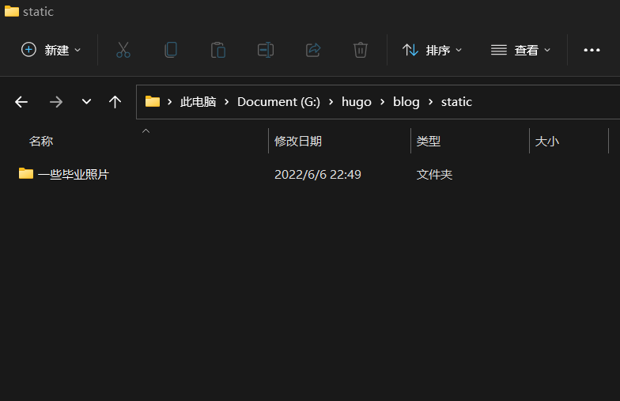

# Hugo插入图片

# hugo建网站插入图片需要注意的小点

在文章中插入图片的方式有绝对路径和相对路劲两种，各有利弊，可以根据情况选择。

* 把图片放到 `static/`（）下，在文章中使用绝对路径引用图片
* 把图片放到和文章同级目录下，通过相对路径引用图片
  从最终效果来看，两种方法在构建后都能正确显示图片，但第一种方法的问题在于使用 `hugo server -D`预览时无法正确加载图片，第二种方法可以在预览时正确加载图片，但会导致 `content/{{section}}/`下多嵌套一层目录。
  之所以把图片放到`static/`下，是因为hugo在构建时会把`static/`下所有内容移到`public/`下。构建后`content/`下的内容也会被移到`public/`下，这样相当于文章和图片有共同的根目录，在文章中使用绝对引用即可正确显示图片。
  
  
  
  
  
  第二种方法是把图片和文章放在同级目录，比如`content/{{section}}/{{article_name}}/`，这样虽会显得`content/`下略显冗余，但可以在预览或构建后都正确显示图片。

<!--more-->

