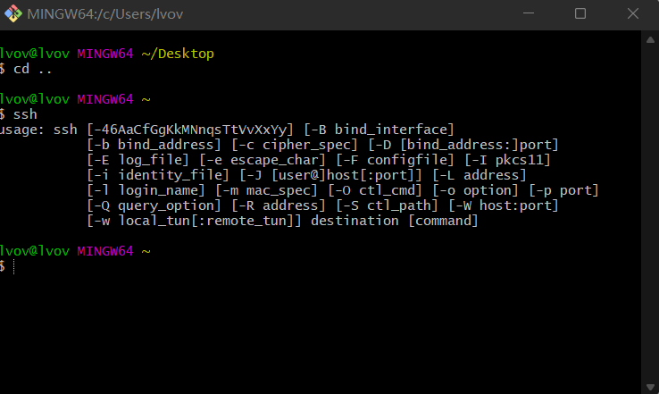
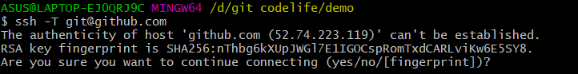
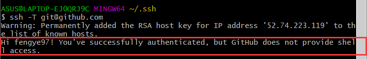
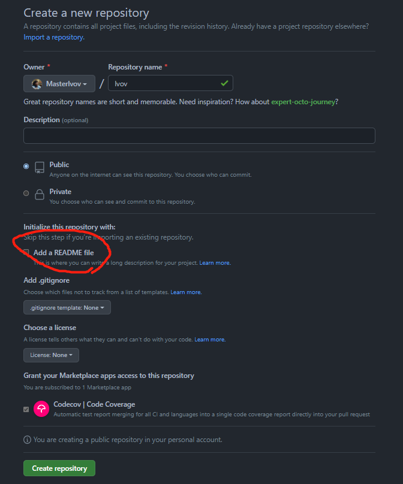
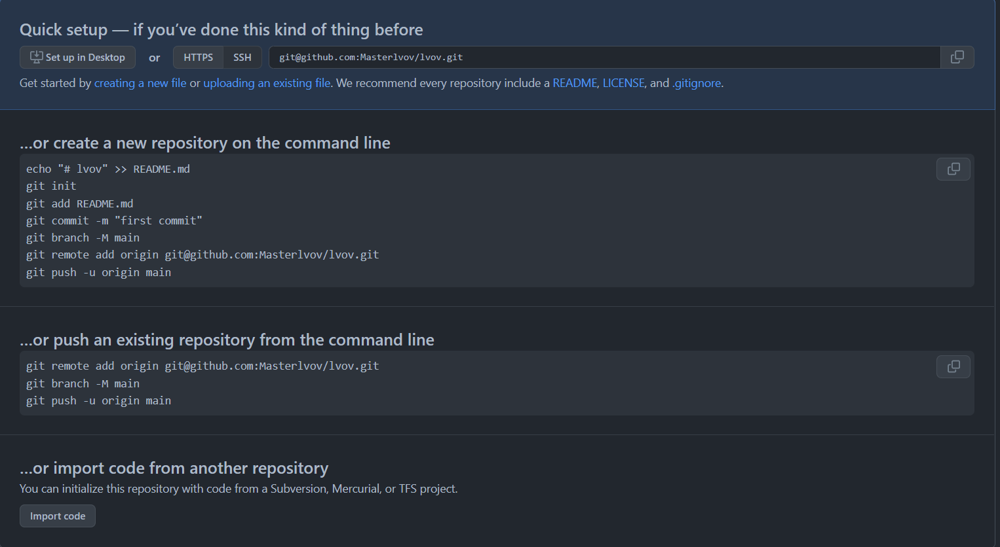
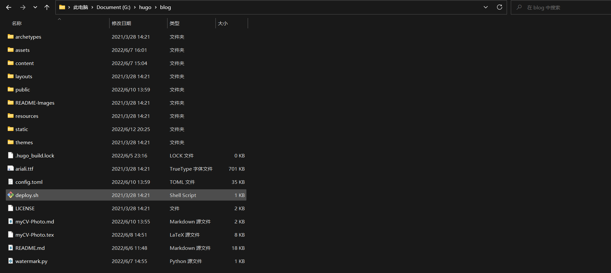
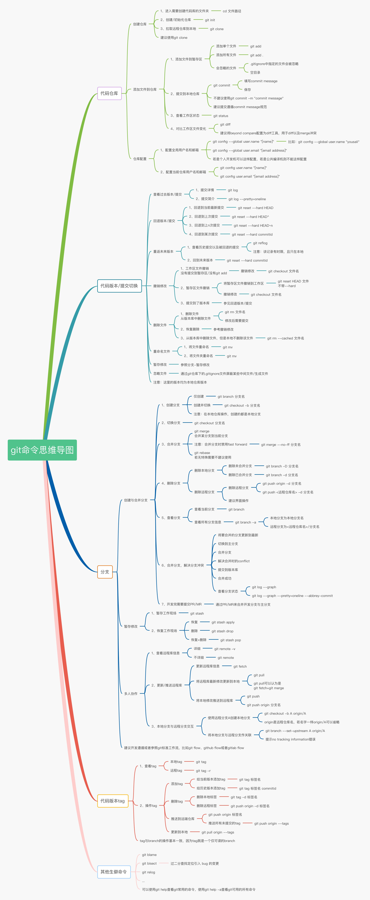

# Git命令大全


下载并安装git之后，之后就是与GitHub绑定以便于上传文件。

### git 绑定github

用git上传文件到GitHub首先得利用SSH登录远程主机，而登录方式有两种：一种是口令登录；另一种是公钥登录。口令登录每次都要输入密码十分麻烦，而公钥登录就省去了输入密码的步骤，所以我们选择公钥授权。首先我们得在 GitHub 上添加 SSH key 配置，要想生成SSH key，就要先安装 SSH，不过我们安装了 Git Bash，其应该自带了 SSH。检验一下是否安装 SSH，我们在新建的文件夹中右键打开 Git Bash：如上图所示，即已安装 SSH.



然后，输入 ssh-keygen -t rsa 命令 ，表示我们指定 RSA 算法生成密钥，然后敲四次回车键，之后就就会生成两个文件，分别为秘钥 id_rsa 和公钥 id_rsa.pub.   文件的位置在 Git Bash 上面都有显示，比如：C:\Users\lvov\.ssh

接下来我们要做的事情就是把公钥 id_rsa.pub 的内容添加到 GitHub。复制公钥 id_rsa.pub 文件里的内容，你可以通过目录找到 id_rsa.pub 文件的位置，用记事本打开文件复制。

然后到我们的 GitHub 主页，先点击右上角，再点击 ***settings*** ---***SSH and GPG keys***---***New SSH key.***将公钥 id_rsa.pub 文件里的内容粘贴即可。验证是否成功，我们可以通过在 Git Bash 中输入 ssh -T [git@github.com](mailto:git@github.com) 进行检验：



第一次会出现这种情况，填 yes 就行，若出现下图中的情况，则表明绑定成功：


然后就可以上传文件了。

绑定的操作步骤

```
#下载git，生成SSH key 
ssh-keygen -t rsa 
#然后在C:\Users\lvov\.ssh目录找到 id_rsa.pub ，将其中内容复制到GitHub上。
```

### 利用git上传代码到云端

如下图所示在GitHub主页新建仓库，一般上不要选择新建README.md文件，这样会使得默认有个main分支（以前也是master分支），而在git客户端默认分支是master，这样会导致多一步操作。



创建成功如下图所示，显然我们需要用到的就是以下的几个命令。



然后我们可以在本地创建一个项目，如下图所示。


然后我们在该目录下git bash here打开git，

首先 `git init`初始化，我们可以发现此时多了一个.git文件夹，这就是跟踪管理版本库的。

接着执行指令：`git add .`（将所有文件添加到仓库）

然后执行指令：`git commit -m "commit info"`（把文件提交到本地仓库）

然后执行指令：
`git remote add origin git@github.com:Masterlvov/lvov.git`（关联GitHub仓库）

执行指令：`git push -u origin master`（一般第一次推送会出现问题，因为本地的 git 库和远程的库并不是一致的，需要进行一次 pull 操作才能继续 push。 第一种解决办法就是加参数 -f ，强制推送，但是这样很危险，会导致其他的更新提交失败，也就是说原来该库下所有文件都会被删除掉，只剩下本次提交的文件了。日常不建议这么操作，但是其实本次第一次是可以的，因为当前库下没有还没有有效文件。`git push -u -f origin master`）

到此，本地代码已经推送到github仓库了，我们现在去githubt仓库看看。

第一次关联操作也就是以下几个步骤：

```
#在GitHub主页创建仓库（不要添加README.md文件），本地创建项目，然后在该目录右键git bash here打开git依次执行以下命令
#初始化
git init
#将所有文件添加到仓库
git add .
#把文件提交到本地仓库
git commit -m "commit info"
#关联GitHub仓库
git remote add origin git@github.com:Masterlvov/lvov.git
# 推送到远程仓库
git push -u origin master
# 第一次失败的解决办法
git push -u origin master
```

##### 日常推送操作

```
# 将修改推至本地库
git add .
git commit -m "commit info"
# 将修改推至远程库
git push -u origin master
```

### git命令大全图示



<!--more-->


