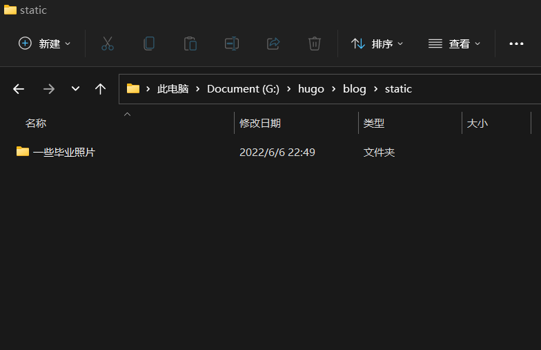
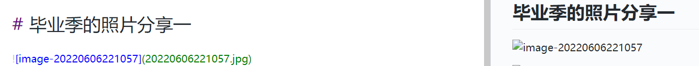

# Hugo日常操作


## hugo日常操作

### 新建文章

```
# 1.新建一篇文章，在网站根目录：G:\hugo\blog
hugo new posts/测试博客.md

# 2.在目录 G:\hugo\blog\content\posts下找到对应文件进行修改

# 3.本地预览, http://localhost:1313/

hugo server -D

# 4.构建 Hugo 网站（在blog目录）

hugo

# 5.切换到目录 H:\HugoWebsite\blog\public ，提交修改至本地库

cd public
git add .
git commit -m 'commit info'

# 6.将修改推至远程库

git push -u origin master
```

### 修改文章

```
# 1.当前工作目录：G:\hugo\blog

# 2.在目录 G:\hugo\blog\content\posts下找到对应文件进行修改

# 3.本地预览, http://localhost:1313/ 

hugo server -D

# 4.构建 Hugo 网站（在blog目录）

hugo

# 5.切换到目录 G:\hugo\blog\public ，提交修改至本地库

cd public
git add .
git commit -m 'commit info'

# 6.将修改推至远程库

git push -u origin master
```

### 删除文章

```
# 1.当前工作目录：G:\hugo\blog

# 2.删除两处文件（在目录 G:\hugo\blog\content\posts 、G:\hugo\blog\public  下找到对应文件进行删除），其中 public 下文件不删除也不影响显示，只是该文件就会一直存在，另外该目录下即便文件（除.git)删错或者全部删除也是不影响的，应为 hugo 命令会全部重建。

# 3.本地预览, http://localhost:1313/ 

hugo server -D

# 4.构建 Hugo 网站

hugo

# 5.切换到目录 H:\HugoWebsite\blog\public ，提交修改至本地库

cd public
git add .
git commit -m 'commit info'

# 6.将修改推至远程库

git push -u origin master
```

#### 删除博客不完全导致文章不能正常显示

如果文章删除不完全，就再推送，导致文章页面出错，不能显示。这是删除此篇文章（posts和public下对应内容），再新建一篇即可正常显示。

### hugo博文内增加图片

在文章中插入图片的方式有绝对路径和相对路劲两种，各有利弊，可以根据情况选择。

* 把图片放到 `static/`（）下，在文章中使用绝对路径引用图片
* 把图片放到和文章同级目录下，通过相对路径引用图片

 从最终效果来看，两种方法在构建后都能正确显示图片，但第一种方法的问题在于使用 `hugo server -D`预览时无法正确加载图片，第二种方法可以在预览时正确加载图片，但会导致 `content/{{section}}/`下多嵌套一层目录。
  之所以把图片放到 `static/`下，是因为hugo在构建时会把 `static/`下所有内容移到 `public/`下。构建后 `content/`下的内容也会被移到 `public/`下，这样相当于文章和图片有共同的根目录，在文章中使用绝对引用即可正确显示图片。比如下面几张图。

<center><p> </p></center>

<center><p> </p></center>

  

第二种方法是把图片和文章放在同级目录 `content/{{section}}/{{article_name}}/`，这样虽会显得 `content/`下略显冗余，但可以在预览或构建后都正确显示图片。

<!--more-->


