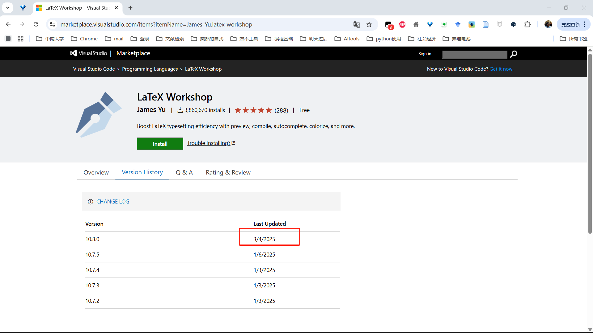
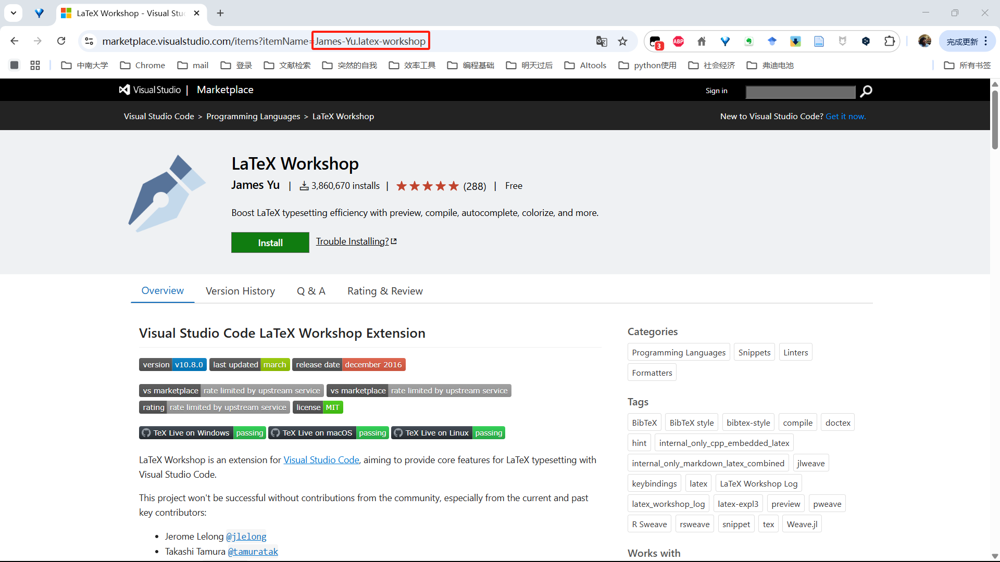
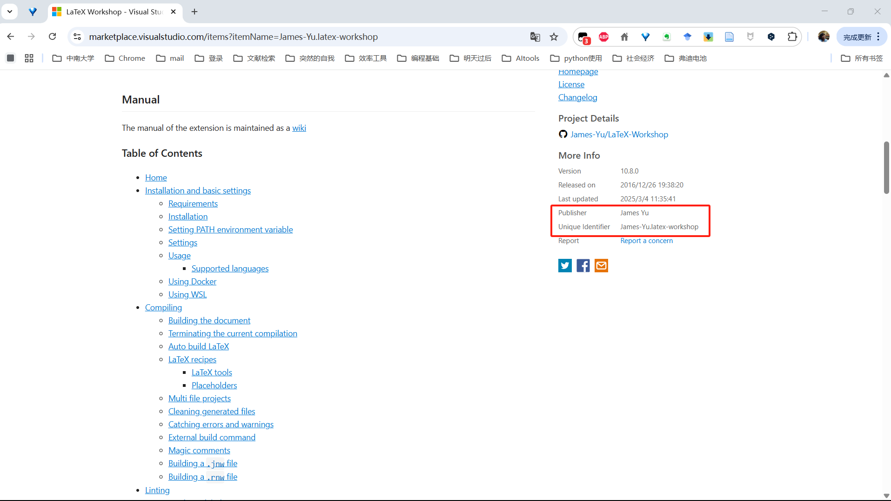

# vscode插件离线安装

vscode插件市场无法直接下载插件了（隐藏了下载链接）,如下图所示，那么如何下载呢？


### 获取下载URL

1. **获取插件唯一标识符**

* 在插件市场页面（如 `https://marketplace.visualstudio.com/items?itemName=PublisherName.ExtensionName`）的 URL 中找到插件唯一标识符，通常格式为 `PublisherName.ExtensionName`（如 `James-Yu.latex-workshop`）。
* 例如，用户提供的示例链接中包含 `James-Yu/extension/latex-workshop/10.8.0`，其中 `10.8.0` 是版本号。如下图可以找到标识符。

2. **构造历史版本下载链接**
   * 官方插件下载链接的通用格式为：

     ```
     https://{Publisher}.gallery.vsassets.io/_apis/public/gallery/publisher/{Publisher}/extension/{ExtensionName}/{Version}/assetbyname/Microsoft.VisualStudio.Services.VSIXPackage
     ```
   * 将 `{Version}` 替换为具体版本号即可下载对应版本。例如，下载 `LaTeX Workshop 10.8.0` 的链接为：

     ```
     https://James-Yu.gallery.vsassets.io/_apis/public/gallery/publisher/James-Yu/extension/latex-workshop/5.3.0/assetbyname/Microsoft.VisualStudio.Services.VSIXPackage
     ```





3. **手动下载并安装**

   * 将构造的链接粘贴至浏览器直接下载 `.vsix` 文件，然后通过 VSCode 的 **扩展面板 → 右上角“…” → Install from VSIX** 进行安装

