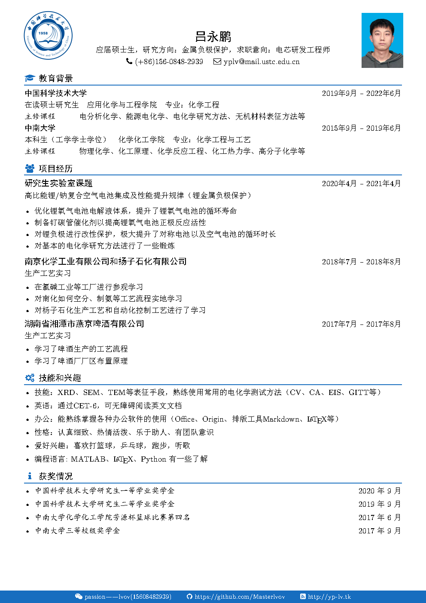

# 一个简洁的中文简历Latex模板


## 一个简洁的中文简历 LaTeX模板

[源文件](https://github.com/Masterlvov/lvov_resume)包括 myCV-Photo.tex+必要的图片（logo、免冠照片）

替换简历中的个人信息（图片、个人信息等）使用xelatex编译

```
xelatex myCV-Photo.tex
```

编译好的简历如下图所示：



# References

[Htallone/resume](https://github.com/Htallone/myCV)

[billryan/resume](https://github.com/billryan/resume)

[WonderCV ](https://www.wondercv.com/zh-CN/resume_templates)

# License

[The MIT License (MIT)](http://opensource.org/licenses/MIT)

<!--more-->


