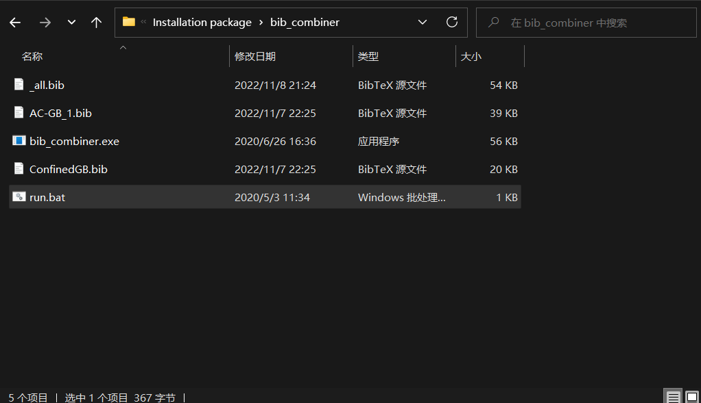

# 合并bib文件并去重的方法

如下图所示，将两个bib文件与所用到的工具放在同一文件夹下，然后运行，即可得到合并去重后的文件。
 

需要用到的小工具[下载链接](https://tpu01yzx.me/share/bib_combiner.zip)。

# References

[BibtexParser](https://github.com/tpu01yzx/BibtexParser)

[tpu01yzx's blog](https://tpu01yzx.me/p/1004)

<!--more-->

