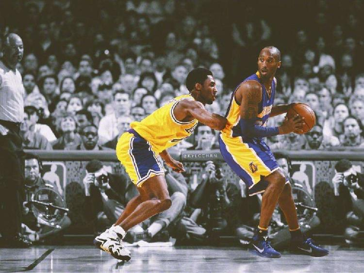

# 科比：梦想的力量

那些起早努力的日子，那些熬夜的时光，那些你太累觉得站不起来却依然之城自己起身得夜晚，那才是梦想的力量，重要的不是结果，是过程，也许你的梦想不会实现，但是更好的一定在路上。[kobe](https://www.youtube.com/watch?v=3Sq_SAO4gaY)

You do the work

如果你付出努力

you work hard enough

足够努力

dreams come true

梦想会实现

you know that

你知道这个道理

that we all know that

我们都知道这个道理

But hopefully would you get from tonight?

但是希望你你们今晚能明白的是

Is your standing that?

你们能感悟到

Those times when you get up early and

那些你早早起来的时刻

you work hard

你努力付出

Those times you stay up late and you work hard

那些你努力到晚上很迟，努力付出

Those times when you don't feel like working

那些你不想努力的时刻

you're too tired

你太累了

You don't wanna push yourself

你不想再逼你自己

but you do it anyway

但你还是坚持努力了

That is actually the dream

这些时刻才是梦想本身

That's the dream

这些时刻就是梦想

**it's not the destination, it's the journey**

**梦想无关终点，关键在于过程**

And if you guys can understand that

如果你们能明白这个道理

then what you'll see happen is that

你们将看到

you won't accomplish your dreams

你不能实现你的梦想

your dreams won't come true

你的梦想不会成真

Something greater will

更伟大的梦想能实现

[kobetalk](https://v.qq.com/x/page/u327036h4c8.html)

<!--more-->

